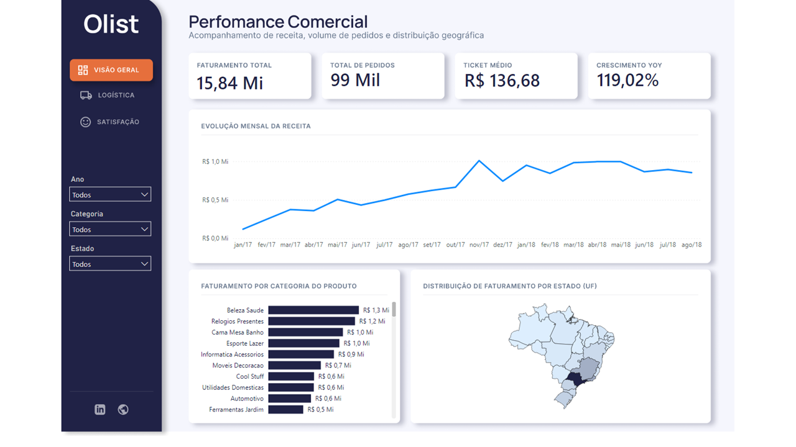
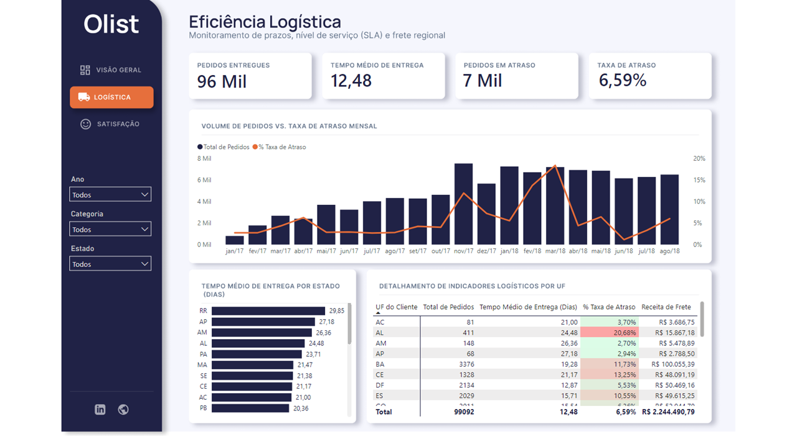
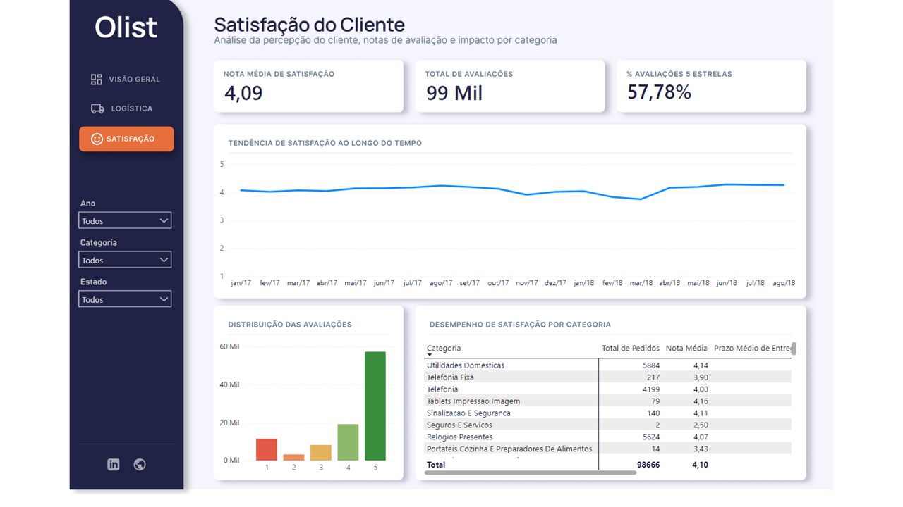
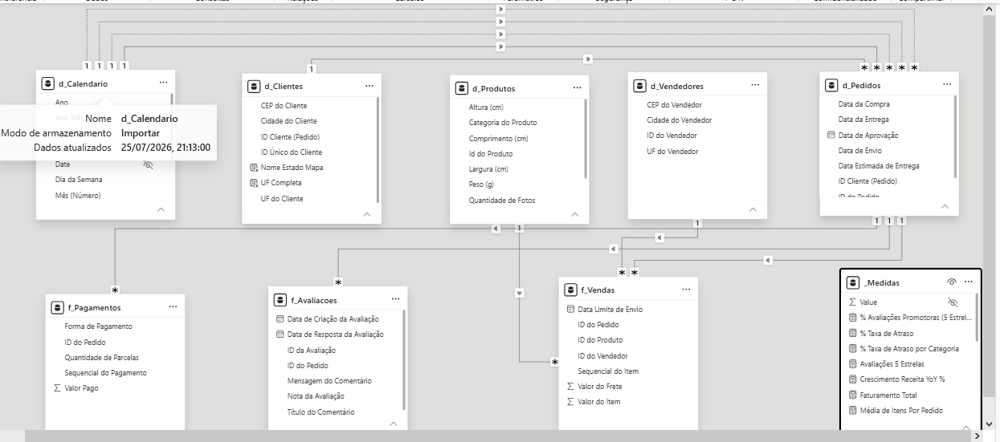

# Dashboard E-commerce (Olist)
### Projeto Prático de Análise e Engenharia de Dados (End-to-End)

---

🔗 [**Clique aqui para acessar o Dashboard Interativo**](https://app.powerbi.com/view?r=eyJrIjoiZWM5YzNlNDQtZjMyZi00NDNmLThlODYtOTlmMjQ0MmJlZmY0IiwidCI6IjQwNTBmNTliLTViYTItNGEwOS04NDU4LWI2MjUwOWM0Yzk3ZCJ9)

---

## Sobre o Projeto

Este projeto consiste em uma solução analítica *End-to-End* para monitoramento da operação de e-commerce da **Olist**. O pipeline engloba desde a ingestão dos dados brutos do Kaggle em um banco de dados relacional na nuvem até a criação de um aplicativo analítico no Power BI focado em decisões executivas.

Para garantir a integridade estatística da análise, os dados foram delimitados entre **Janeiro/2017 e Agosto/2018**, eliminando ruídos dos meses de borda e garantindo métricas consolidadas.

### Visões da Aplicação:

1. **Visão Geral:** Acompanhamento de faturamento, volume de pedidos, ticket médio, crescimento YoY e distribuição geográfica.

2. **Eficiência Logística:** Monitoramento de tempos de entrega, cumprimento de SLA (atrasos) e volume mensal de expedição.

3. **Satisfação do Cliente:** Percepção do consumidor, distribuição de notas (1 a 5 estrelas) e notas médias detalhadas por categoria de produto.

## Etapas do Desenvolvimento

1. **Ingestão & Banco de Dados (PostgreSQL + Neon + DataGrip):** Criação do banco relacional na nuvem, definição de schemas e importação dos 9 arquivos `.csv` brutos.
2. **ETL & Tratamento (Power Query):** Conexão ao PostgreSQL, higienização, tipagem correta de datas/moedas e criação da tabela `dCalendario`.
3. **Modelagem de Dados (Star Schema):** Conexão em estrela entre tabelas fato (*Vendas, Entregas, Avaliações*) e dimensões (*Clientes, Produtos, Vendedores, Calendário*).

4. **UI/UX Design (Figma & Google Stitch):** Criação dos layouts de tela, cartões flutuantes, botões de navegação e ícones vetorizados.
5. **Cálculos em DAX:** Construção de inteligência temporal (YoY, MoM) e métricas acumuladas/médias.
6. **Data Visualization & Interatividade:**   - Navegação lateral via botões e *tooltips* explicativos.   - Sincronização de fatiadores com busca rápida por categoria.   - Gráficos otimizados sem redundância de eixos.   - Layout responsivo adaptado para **Dispositivos Móveis (Layout Móvel)**.

## Arquitetura e Engenharia de Dados

O pipeline de dados foi construído seguindo as etapas:
1. **Fonte dos Dados:** Coleta dos 9 arquivos brutos (`.csv`) do dataset público da Olist no Kaggle. [Clique aqui para acessar o dataset da Olist](https://www.kaggle.com/datasets/olistbr/brazilian-ecommerce)
2. **Banco de Dados na Nuvem:** Instanciação do banco de dados **PostgreSQL** hospedado na plataforma [**Neon**](https://neon.com/).
3. **Modelagem & Ingestão (DataGrip):** Estruturação do schema `olist` e carga completa das 9 tabelas relacionais via [**DataGrip**](https://www.jetbrains.com/pt-br/datagrip/).
4. **Consumo no Power BI:** Conexão nativa entre o Power BI e a instância do PostgreSQL no Neon para extração e modelagem das visões analíticas.

---

## Principais Indicadores (KPIs)

- **Faturamento Total:** R$ 15,84 Milhões
- **Total de Pedidos:** 99 Mil
- **Ticket Médio:** R$ 136,68
- **Crescimento YoY:** 119,02%
- **Tempo Médio de Entrega:** 12,50 Dias
- **Taxa de Atraso Operacional:** 6,57%
- **Nota Média de Satisfação:** 4,09 / 5,0

---
## Design e UI/UX

A interface foi inteiramente prototipada e desenhada utilizando **Figma** e **Google Stitch**.

### Paleta de Cores:
- `#202246` — **Azul Escuro:** Fundo principal do menu lateral e cabeçalhos.
- `#E66F3C` — **Laranja Destaque:** Cor primária de ação, botões selecionados e alertas.
- `#64748B` — **Slate/Cinza:** Textos secundários e elementos de apoio.
- `#FFFFFF` — **Branco:** Fundo dos cartões e alto contraste para leitura de dados.
---

---

## Medidas DAX Utilizadas

Todas as medidas DAX, tabela d_Calendario e colunas de apoio de geolocalização foram organizadas e documentadas em um arquivo dedicado.

🔗 [**Clique aqui para ver a documentação completa das medidas DAX**](./dax/medidas_dax.md)

---

## Vídeo Demonstrativo

> *Em breve*

---

## Autor

Desenvolvido por **Isaias Santos**

* [LinkedIn](https://www.linkedin.com/in/isaiassousadossantos/)
* [Meu Site / Portfólio](https://isaiassantos.works/)